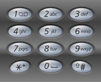

### Letter Combinations of a Phone Number

Given a string containing digits from `2-9` inclusive, return all possible letter combinations that the number could represent.</br>
A mapping of digit to letters (just like on the telephone buttons) is given below. Note that 1 does not map to any letters.



__Example 1:__
```
Input: digits = "23"
Output: ["ad","ae","af","bd","be","bf","cd","ce","cf"]
```
__Example 2:__
```
Input: digits = ""
Output: []
```
__Example 3:__
```
Input: digits = "2"
Output: ["a","b","c"]
```

__Constraints:__
* `0 <= digits.length <= 4`
* `digits[i]` is a digit in the range `['2', '9']`.

### Solution
__O(pow(4, digits)) Time, O(pow(4, digits)) Space:__
```Swift
class Solution {
    // Phone key to corresponding letters lookup
    let lookup: [Character: [Character]] = [
        "2": ["a", "b", "c"],
        "3": ["d", "e", "f"],
        "4": ["g", "h", "i"],
        "5": ["j", "k", "l"],
        "6": ["m", "n", "o"],
        "7": ["p", "q", "r", "s"],
        "8": ["t", "u", "v"],
        "9": ["w", "x", "y", "z"],
    ]

    func letterCombinations(_ digits: String) -> [String] {
        guard !digits.isEmpty else { return [] }
        var temp: [Character] = []
        var result: [String] = []
        generate(Array(digits), 0, &temp, &result)
        return result
    }

    func generate(_ digits: [Character], _ index: Int, _ temp: inout [Character], _ result: inout [String]) {
        if index == digits.count {
            // If index reaches digit count, we know we've reached a possible solution,
            // add the solution to result
            result.append(String(temp))
        } else if let characters = lookup[digits[index]] {
            // Exhaust all combinations of letters for a particular key
            for character in characters {
                temp.append(character)
                generate(digits, index + 1, &temp, &result)
                temp.removeLast()
            }
        }
    }
}
```