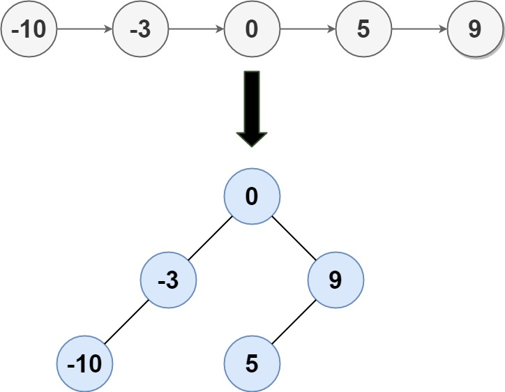

### Convert Sorted List to Binary Search Tree

Given the `head` of a singly linked list where elements are sorted in ascending order, convert it to a 
height-balanced binary search tree. 

__Example 1:__


```
Input: head = [-10,-3,0,5,9]
Output: [0,-3,9,-10,null,5]
Explanation: One possible answer is [0,-3,9,-10,null,5], which represents the shown height balanced BST.
```
__Example 2:__
```
Input: head = []
Output: []
```

__Constraints:__
* The number of nodes in head is in the range `[0, 2 * pow(10, 4)]`.
* `-pow(10, 5) <= Node.val <= pow(10, 5)`

### Solution
```Swift
/**
 * Definition for singly-linked list.
 * public class ListNode {
 *     public var val: Int
 *     public var next: ListNode?
 *     public init(_ val: Int) {
 *         self.val = val
 *         self.next = nil
 *     }
 * }
 */
/**
 * Definition for a binary tree node.
 * public class TreeNode {
 *     public var val: Int
 *     public var left: TreeNode?
 *     public var right: TreeNode?
 *     public init(_ val: Int) {
 *         self.val = val
 *         self.left = nil
 *         self.right = nil
 *     }
 * }
 */
class Solution {
    func sortedListToBST(_ head: ListNode?) -> TreeNode? {
        
        // If ListNode is nil, we've processed past the end of the sublist
        // return a nil TreeNode
        guard let prev = partition(head) else { return nil }

        // If there's only one node in the sublist, return TreeNode with
        // the ListNode's value
        guard let curr = prev.next else { return TreeNode(prev.val) }

        // Divide the left & right sublist down the middle
        prev.next = nil

        // Create TreeNode from the value of the mid ListNode of the sublist
        let node = TreeNode(curr.val)

        // Assign the TreeNode's left & right subtrees
        node.left = sortedListToBST(head)
        node.right = sortedListToBST(curr.next)
        return node
    }
    
    // Helper method to find the node before the middle of the linked list
    func partition(_ head: ListNode?) -> ListNode? {
        var slow = head, fast = head
        while let nextFast = fast?.next?.next, let _ = nextFast.next {
            fast = nextFast
            slow = slow?.next
        }
        return slow
    }
}
```