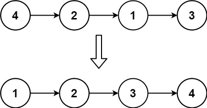
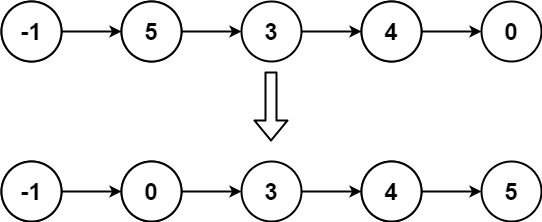

### Insertion Sort List

Given the `head` of a singly linked list, sort the list using __insertion sort__, and return the sorted list's head.

The steps of the insertion sort algorithm:

1. Insertion sort iterates, consuming one input element each repetition and growing a sorted output list.
2. At each iteration, insertion sort removes one element from the input data, finds the location it belongs within the sorted list and inserts it there.
3. It repeats until no input elements remain.

The following is a graphical example of the insertion sort algorithm. The partially sorted list (black) initially contains only the first element in the list. One element (red) is removed from the input data and inserted in-place into the sorted list with each iteration.


__Example 1:__


```
Input: head = [4,2,1,3]
Output: [1,2,3,4]
```
__Example 2:__


```
Input: head = [-1,5,3,4,0]
Output: [-1,0,3,4,5]
```

__Constraints:__
* The number of nodes in the list is in the range `[1, 5000]`.
* `-5000 <= Node.val <= 5000`

### Solution
__O(pow(nodes, 2)) Time:__
```Swift
/**
 * Definition for singly-linked list.
 * public class ListNode {
 *     public var val: Int
 *     public var next: ListNode?
 *     public init() { self.val = 0; self.next = nil; }
 *     public init(_ val: Int) { self.val = val; self.next = nil; }
 *     public init(_ val: Int, _ next: ListNode?) { self.val = val; self.next = next; }
 * }
 */
class Solution {
    func insertionSortList(_ head: ListNode?) -> ListNode? {
        let dummyHead: ListNode = ListNode(0)
        var curr: ListNode? = head
        while let node = curr {
            // Keep a reference to current node's next
            let next: ListNode? = node.next

            // Insert current node into the right place in result
            var iter: ListNode? = dummyHead
            // Iterate through result to find the first node greater than
            // the current node
            while let next = iter?.next, next.val <= node.val {
                iter = next
            }
            let temp: ListNode? = iter?.next
            iter?.next = node
            node.next = temp

            // Assign current node's next as the current node
            curr = next
        }
        return dummyHead.next
    }
}
```
