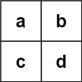

### Word Search II

Given an `m x n` `board` of characters and a list of strings `words`, return __all words on the board__.

Each word must be constructed from letters of sequentially __adjacent cells__, where adjacent cells are horizontally or vertically neighboring. The same letter cell may not be used more than once in a word.

__Example 1:__


```
Input: board = [["o","a","a","n"],["e","t","a","e"],["i","h","k","r"],["i","f","l","v"]], words = ["oath","pea","eat","rain"]
Output: ["eat","oath"]
```
__Example 2:__


```
Input: board = [["a","b"],["c","d"]], words = ["abcb"]
Output: []
```

__Constraints:__
* `m == board.length`
* `n == board[i].length`
* `1 <= m, n <= 12`
* `board[i][j]` is a lowercase English letter.
* `1 <= words.length <= 3 * pow(10, 4)`
* `1 <= words[i].length <= 10`
* `words[i]` consists of lowercase English letters.
* All the strings of `words` are unique.

### Solution
__Brute Force DFS, TLE:__
```Swift
class Solution {
    func findWords(_ board: [[Character]], _ words: [String]) -> [String] {
        guard !board.isEmpty else { return [] }
        let words: Set<String> = Set(words)
        var board: [[Character]] = board
        var result: Set<String> = []
        for row in 0 ..< board.count {
            for col in 0 ..< board.first!.count {
                walk(&board, row, col, words, "", &result)
            }
        }
        return Array(result)
    }

    func walk(_ board: inout [[Character]], _ row: Int, _ col: Int, _ words: Set<String>, _ temp: String, _ result: inout Set<String>) {
        switch (row, col) {
        case (0 ..< board.count, 0 ..< board.first!.count) where board[row][col] != ".":
            let char: Character = board[row][col]
            let temp: String = temp + [char]
            if words.contains(temp) {
                result.insert(temp)
            } else if !words.contains(where: { $0.hasPrefix(temp) }) {
                break
            }
            board[row][col] = "."
            for offset in [-1, 1] {
                walk(&board, row + offset, col, words, temp, &result)
                walk(&board, row, col + offset, words, temp, &result)
            }
            board[row][col] = char
        default:
            break
        }
    }
}
```
__O(pow(row * col, 2) + k * words) Time, O(k * words) Space - Prefix Tree + DFS Traversal:__
```Swift
extension Character {
    var offset: Int {
        return Int(asciiValue! - Character("a").asciiValue!)
    }
}

class Solution {
    
    // TrieNode data structure declaration
    private class TrieNode {
        var nodes: [TrieNode?] = Array(repeating: nil, count: 26)
        var word: String?
    }

    // Helper method to add words to the Trie
    private func add(_ word: String) {
        var curr: TrieNode = root
        for char in word {
            let offset: Int = char.offset
            let node: TrieNode = curr.nodes[offset] ?? TrieNode()
            curr.nodes[offset] = node
            curr = node
        }
        curr.word = word
    }
    
    // Root node of the Trie
    private let root = TrieNode()
    
    func findWords(_ board: [[Character]], _ words: [String]) -> [String] {
        guard !board.isEmpty else { return [] }
        var board: [[Character]] = board
        var result: Set<String> = []
        words.forEach(add)
        for row in 0 ..< board.count {
            for col in 0 ..< board.first!.count {
                walk(&board, row, col, root, &result)
            }
        }
        return Array(result)
    }
    
    // Helper method to walk the board & record words seen
    private func walk(_ board: inout [[Character]], _ row: Int, _ col: Int, _ curr: TrieNode, _ result: inout Set<String>) {
        switch (row, col) {
            case (0 ..< board.count, 0 ..< board.first!.count) where board[row][col] != "%":
            let char = board[row][col]
            if let node = curr.nodes[char.offset] {
                if let word = node.word {
                    result.insert(word)
                }
                board[row][col] = "%"
                for next in [-1, 1] {
                    walk(&board, row + next, col, node, &result)
                    walk(&board, row, col + next, node, &result)
                }
                board[row][col] = char
            }
            default:
            break
        }
    }
}
```