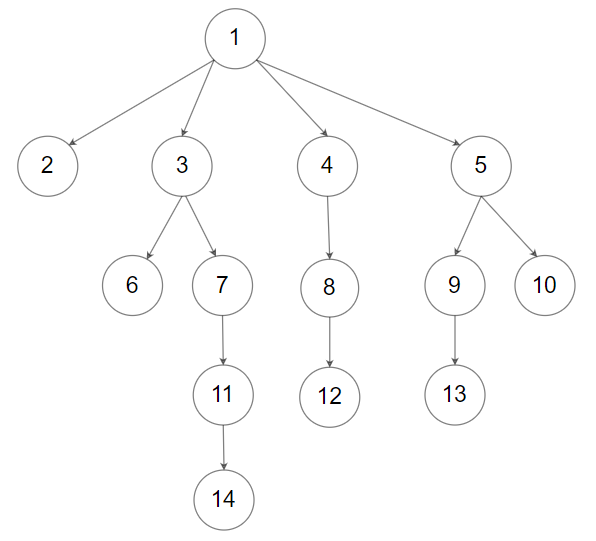

### N-ary Tree Preorder Traversal

Given an n-ary tree, return the __preorder__ traversal of its nodes' values.

*Nary-Tree input serialization is represented in their level order traversal, each group of children is separated by the null value (See examples).*

__Follow up:__
Recursive solution is trivial, could you do it iteratively?

__Example 1:__


```
Input: root = [1,null,3,2,4,null,5,6]
Output: [1,3,5,6,2,4]
```
__Example 2:__



```
Input: root = [1,null,2,3,4,5,null,null,6,7,null,8,null,9,10,null,null,11,null,12,null,13,null,null,14]
Output: [1,2,3,6,7,11,14,4,8,12,5,9,13,10]
```

__Constraints:__
* The height of the n-ary tree is less than or equal to `1000`
* The total number of nodes is between `[0, 10^4]`

### Solution
__O(n) Time, O(1) Space - Recursive:__
```Swift
/**
 * Definition for a Node.
 * public class Node {
 *     public var val: Int
 *     public var children: [Node]
 *     public init(_ val: Int) {
 *         self.val = val
 *         self.children = []
 *     }
 * }
 */

class Solution {
    func preorder(_ root: Node?) -> [Int] {
      var result : [Int] = []
        preOrder(root, &result)
        return result
    }
    
    func preOrder(_ node: Node?, _ result: inout [Int]) {
        guard let node = node else { return }
        result.append(node.val)
        node.children.forEach {
            preOrder($0, &result)
        }
    }
}
```
__O(n) Time, O(n) Space - Iterative:__
```Swift
/**
 * Definition for a Node.
 * public class Node {
 *     public var val: Int
 *     public var children: [Node]
 *     public init(_ val: Int) {
 *         self.val = val
 *         self.children = []
 *     }
 * }
 */

class Solution {
    func preorder(_ root: Node?) -> [Int] {
        guard let root = root else { return [] }
      var stack = [root], result : [Int] = []
        while !stack.isEmpty {
            let curr = stack.removeLast()
            for i in stride(from: curr.children.count-1, through: 0, by: -1) {
                stack.append(curr.children[i])
            }
            result.append(curr.val)
        }
        return result
    }
}
```