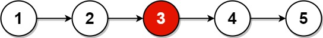

### Middle of the Linked List

Given the `head` of a singly linked list, return the middle node of the linked list.

If there are two middle nodes, return the __second middle__ node.

__Example 1:__

```
Input: head = [1,2,3,4,5]
Output: [3,4,5]
Explanation: The middle node of the list is node 3.
```
__Example 2:__
```
Input: [1,2,3,4,5,6]
Output: Node 4 from this list (Serialization: [4,5,6])
Since the list has two middle nodes with values 3 and 4, we return the second one.
```

__Note:__
* The number of nodes in the given list will be between `1` and `100`.

### Solution
__O(n):__
```Swift
/**
 * Definition for singly-linked list.
 * public class ListNode {
 *     public var val: Int
 *     public var next: ListNode?
 *     public init(_ val: Int) {
 *         self.val = val
 *         self.next = nil
 *     }
 * }
 */
class Solution {
    func middleNode(_ head: ListNode?) -> ListNode? {
        var fast = head, slow = head
        while let node = fast, let next = node.next {
            fast = next.next
            slow = slow?.next
        }
        return slow
    }
}
```