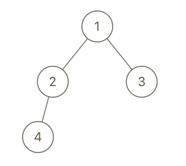

### Cousins in Binary Tree

In a binary tree, the root node is at depth `0`, and children of each depth `k` node are at depth `k+1`.

Two nodes of a binary tree are cousins if they have the same depth, but have __different parents__.

We are given the `root` of a binary tree with unique values, and the values `x` and `y` of two different nodes in the tree.

Return `true` if and only if the nodes corresponding to the values `x` and `y` are cousins.

__Example 1:__


```
Input: root = [1,2,3,4], x = 4, y = 3
Output: false
```
__Example 2:__


```
Input: root = [1,2,3,null,4,null,5], x = 5, y = 4
Output: true
```
__Example 3:__


```
Input: root = [1,2,3,null,4], x = 2, y = 3
Output: false
```

__Note:__
1. The number of nodes in the tree will be between `2` and `100`.
2. Each node has a unique integer value from `1` to `100`.

### Solution
__O(n) Time, O(1) Space - Recursive:__
```Swift
/**
 * Definition for a binary tree node.
 * public class TreeNode {
 *     public var val: Int
 *     public var left: TreeNode?
 *     public var right: TreeNode?
 *     public init(_ val: Int) {
 *         self.val = val
 *         self.left = nil
 *         self.right = nil
 *     }
 * }
 */
class Solution {
    func isCousins(_ root: TreeNode?, _ x: Int, _ y: Int) -> Bool {
        if let result = isCousins(root, x, y, 0), result != -1 {
            return true
        }
        return false
    }
    
    // The return value can take on 3 states:
    // nil: target node is not found in the subtree
    // -1: targets are found but are not cousins
    // 0...Int.max: level of the target
    func isCousins(_ root: TreeNode?, _ x: Int, _ y: Int, _ level: Int) -> Int? {
        guard let node = root else { return nil }
        
        // If current node is one of target, track its level
        var curr : Int? = node.val == x || node.val == y ? level : nil
        
        // If current node's left & right child are targets, then they have the same
        // parent: return -1
        switch (node.left?.val, node.right?.val) {
            case (.some(x), .some(y)), (.some(y), .some(x)):
            return -1
            default:
            break
        }
        
        // If we've not found the target nodes, continue searching through the tree
        switch (isCousins(node.left, x, y, level+1), isCousins(node.right, x, y, level+1)) {
            
            // One of the subtrees identified targets that are not cousins: return -1
            case (-1, _), (_, -1):
            return -1
            
            // Targets are found in each of the subtrees
            // If their levels are the same, they are cousins: return their level
            // If their levels are different, they are not cousins: return -1
            case let (.some(lhs), .some(rhs)):
            return lhs == rhs ? lhs : -1
            
            // Target is found in one of the subtrees
            // If current node is the other target, then targets are of ancestry relationship: return -1
            // Otherwise the other target is somewhere in the tree, return the found target's level
            case (.none, .some(let val)), (.some(let val), .none):
            return curr == nil ? val : -1
            
            // If no targets are found in the subtrees
            // Return the level of the current node if it's a target
            // Otherwise return nil
            default:
            return curr
        }
    }
}
```
