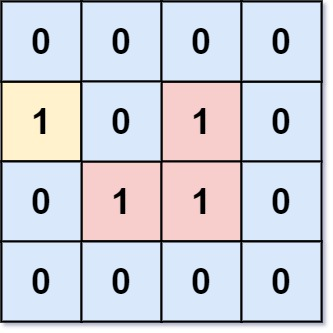

### Number of Enclaves

You are given an `m x n` binary matrix `grid`, where `0` represents a sea cell and `1` represents a land cell.

A __move__ consists of walking from one land cell to another adjacent (__4-directionally__) land cell or walking off the boundary of the `grid`.

Return _the number of land cells in_ `grid` _for which we cannot walk off the boundary of the grid in any number of_ ***moves***.

__Example 1:__



```
Input: grid = [[0,0,0,0],[1,0,1,0],[0,1,1,0],[0,0,0,0]]
Output: 3
Explanation: There are three 1s that are enclosed by 0s, and one 1 that is not enclosed because its on the boundary.
```

__Example 2:__


```
Input: grid = [[0,1,1,0],[0,0,1,0],[0,0,1,0],[0,0,0,0]]
Output: 0
Explanation: All 1s are either on the boundary or can reach the boundary.
```

__Constraints:__
* `m == grid.length`
* `n == grid[i].length`
* `1 <= m, n <= 500`
* `grid[i][j]` is either `0` or `1`.

### Solution
__O(2\*(m*n)) Time:__
```Swift
class Solution {
    func numEnclaves(_ grid: [[Int]]) -> Int {
        guard !grid.isEmpty else { return 0 }
        var grid = grid, numLandCells: Int = 0

        // For every first & last cells in each row, turn boundary land connections into sea
        (0 ..< grid.count).forEach { row in
            [0, grid.first!.count-1].forEach { col in
                if grid[row][col] == 1 {
                    turnBoundaryLandConnectionsIntoSea(grid: &grid, row: row, col: col)
                }
            }
        }

        // For every first & last cells of each column, turn boundary land connections into sea
        (0 ..< grid.first!.count).forEach { col in
            [0, grid.count-1].forEach { row in
                if grid[row][col] == 1 {
                    turnBoundaryLandConnectionsIntoSea(grid: &grid, row: row, col: col)
                }
            }
        }

        // Compute the number of cells that are still land
        (0 ..< grid.count).forEach { row in
            (0 ..< grid.first!.count).forEach { col in
                if grid[row][col] == 1 {
                    numLandCells += 1
                }
            }
        }
        return numLandCells
    }
    
    func turnBoundaryLandConnectionsIntoSea(grid: inout [[Int]], row: Int, col: Int) {
        switch (row, col) {
        case (0 ..< grid.count, 0 ..< grid.first!.count) where grid[row][col] == 1:
            grid[row][col] = 0
            [-1, 1].forEach {
                turnBoundaryLandConnectionsIntoSea(grid: &grid, row: row+$0, col: col)
                turnBoundaryLandConnectionsIntoSea(grid: &grid, row: row, col: col+$0)
            }
        default:
            break
        }
    }
}
```