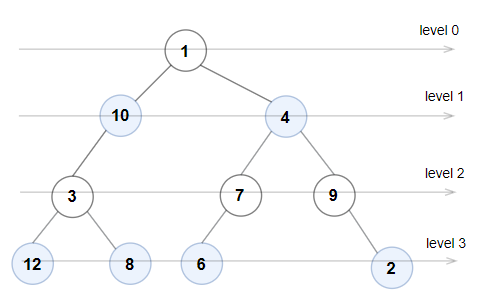

### Even Odd Tree

A binary tree is named __Even-Odd__ if it meets the following conditions:

* The root of the binary tree is at level index `0`, its children are at level index `1`, their children are at level index `2`, etc.
* For every __even-indexed__ level, all nodes at the level have __odd__ integer values in __strictly increasing__ order (from left to right).
* For every __odd-indexed__ level, all nodes at the level have __even__ integer values in __strictly decreasing__ order (from left to right).

Given the `root` of a binary tree, return `true` if the binary tree is __Even-Odd__, otherwise return `false`.

__Example 1:__

```
Input: root = [1,10,4,3,null,7,9,12,8,6,null,null,2]
Output: true
Explanation: The node values on each level are:
Level 0: [1]
Level 1: [10,4]
Level 2: [3,7,9]
Level 3: [12,8,6,2]
Since levels 0 and 2 are all odd and increasing and levels 1 and 3 are all even and decreasing, the tree is Even-Odd.
```
__Example 2:__

```
Input: root = [5,4,2,3,3,7]
Output: false
Explanation: The node values on each level are:
Level 0: [5]
Level 1: [4,2]
Level 2: [3,3,7]
Node values in level 2 must be in strictly increasing order, so the tree is not Even-Odd.
```
__Example 3:__

```
Input: root = [5,9,1,3,5,7]
Output: false
Explanation: Node values in the level 1 should be even integers.
```

__Constraints:__
* The number of nodes in the tree is in the range `[1, pow(10, 5)]`.
* `1 <= Node.val <= pow(10, 6)`

### Solution
__Level Order Traversal:__
```Swift
/**
 * Definition for a binary tree node.
 * public class TreeNode {
 *     public var val: Int
 *     public var left: TreeNode?
 *     public var right: TreeNode?
 *     public init() { self.val = 0; self.left = nil; self.right = nil; }
 *     public init(_ val: Int) { self.val = val; self.left = nil; self.right = nil; }
 *     public init(_ val: Int, _ left: TreeNode?, _ right: TreeNode?) {
 *         self.val = val
 *         self.left = left
 *         self.right = right
 *     }
 * }
 */
class Solution {
    func isEvenOddTree(_ root: TreeNode?) -> Bool {
        guard let root else { return false }
        var queue: [TreeNode] = [root]
        var isEvenLevel: Bool = true
        while !queue.isEmpty {
            let count: Int = queue.count
            var curr: Int?
            for _ in 0 ..< count {
                let node = queue.removeFirst()
                if (isEvenLevel && node.val % 2 == 0) || (!isEvenLevel && node.val % 2 == 1) {
                    return false
                } else {
                    if let prev = curr, (isEvenLevel && node.val <= prev) || (!isEvenLevel && node.val >= prev) {
                        return false
                    }
                    curr = node.val
                    [node.left, node.right].forEach {
                        guard let next = $0 else { return }
                        queue.append(next)
                    }
                }
            }
            isEvenLevel.toggle()
        }
        return true
    }
}
```