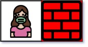

### Nearest Exit from Entrance in Maze

You are given an `m x n` matrix `maze` (__0-indexed__) with empty cells (represented as `'.'`) and walls (represented as `'+'`). You are also given the `entrance` of the maze, where `entrance = [row, col]` denotes the row and column of the cell you are initially standing at.

In one step, you can move one cell __up__, __down__, __left__, or __right__. You cannot step into a cell with a wall, and you cannot step outside the maze. Your goal is to find the __nearest exit__ from the entrance. An __exit__ is defined as an __empty cell__ that is at the __border__ of the `maze`. The `entrance` __does not count__ as an exit.

Return the __number of steps__ in the shortest path from the `entrance` to the nearest exit, or `-1` if no such path exists.

__Example 1:__


```
Input: 
maze = [
    ["+","+",".","+"],
    [".",".",".","+"],
    ["+","+","+","."]
], 
entrance = [1,2]

Output: 1

Explanation: There are 3 exits in this maze at [1,0], [0,2], and [2,3].
Initially, you are at the entrance cell [1,2].
- You can reach [1,0] by moving 2 steps left.
- You can reach [0,2] by moving 1 step up.
It is impossible to reach [2,3] from the entrance.
Thus, the nearest exit is [0,2], which is 1 step away.
```

__Example 2:__


```
Input: 
maze = [
    ["+","+","+"],
    [".",".","."],
    ["+","+","+"]
], 
entrance = [1,0]

Output: 2

Explanation: There is 1 exit in this maze at [1,2].
[1,0] does not count as an exit since it is the entrance cell.
Initially, you are at the entrance cell [1,0].
- You can reach [1,2] by moving 2 steps right.
Thus, the nearest exit is [1,2], which is 2 steps away.
```

__Example 3:__



```
Input: 
maze = [
    [".","+"]
], 
entrance = [0,0]

Output: -1

Explanation: There are no exits in this maze.
```

__Constraints:__
* `maze.length == m`
* `maze[i].length == n`
* `1 <= m, n <= 100`
* `maze[i][j]` is either `'.'` or `'+'`.
* `entrance.length == 2`
* `0 <= entrance.row < m`
* `0 <= entrance.col < n`
* `entrance` will always be an empty cell.

### Solution
__O(m*n), BFS:__
```Swift
class Solution {
    struct Cell: Hashable {
        let row: Int, col: Int
    }
    
    func nearestExit(_ maze: [[Character]], _ entrance: [Int]) -> Int {
        guard !maze.isEmpty, entrance.count == 2 else { return -1 }
        
        // Start from entrance & run BFS to identify the nearest exit layer by layer.
        let start = Cell(row: entrance[0], col: entrance[1])
        var maze = maze, queue: [Cell] = [start]
        
        // Mark visited cell as "wall" to avoid infinite re-visits.
        maze[start.row][start.col] = "+"
        var levels: Int = 0
        while !queue.isEmpty {
            let count = queue.count
            for _ in 0 ..< count {
                let current = queue.removeFirst()
                maze[current.row][current.col] = "+"
                switch (current.row, current.col) {
                case (0, _), (maze.count-1, _), (_, 0), (_, maze.first!.count-1):
                    
                    // The entance cannot be an exit.
                    if current != start {
                        return levels
                    } else {
                        fallthrough
                    }
                    
                default:
                    
                    // Next visits are 4-directional
                    [-1, 1].forEach {
                        [Cell(row: current.row+$0, col: current.col), Cell(row: current.row, col: current.col+$0)].forEach { cell in
                            switch (cell.row, cell.col) {
                                case (0 ..< maze.count, 0 ..< maze.first!.count) where maze[cell.row][cell.col] == ".":
                                maze[cell.row][cell.col] = "+"
                                queue.append(cell)
                                default:
                                break
                            }
                        }
                    }
                }
            }
            levels += 1
        }
        return -1
    }
}
```